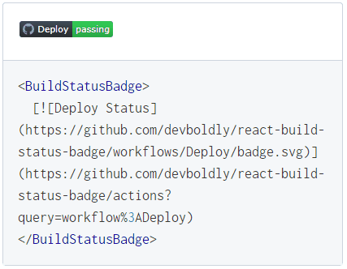

<h2 align="center">
  <a href="https://github.com/devboldly/react-build-status-badge">React Build Status Badge</a>
</h2>
<h3 align="center">
  React build status badge component for any CI/CD service.<br/>Shows real-time status and supports Markdown for easy setup.
</h3>
<p align="center">
  <a href="https://badge.fury.io/js/react-build-status-badge">
    
  </a>
  <a href="https://github.com/devboldly/react-build-status-badge/actions?query=workflow%3ATests">
    
  </a>
  <a href="https://github.com/devboldly/react-build-status-badge/actions?query=workflow%3ADeploy">
    
  </a>
</p>

## Documentation 

Read the **[official documentation](https://devboldly.github.io/react-build-status-badge/)**.

<a href="https://devboldly.github.io/react-build-status-badge/BuildStatusBadge#using-markdown-image-link"></a>

👁️ **[Live Demo](https://devboldly.github.io/react-build-status-badge/BuildStatusBadge#using-markdown-image-link)**

## Overview

[BuildStatusBadge](https://devboldly.github.io/react-build-status-badge/BuildStatusBadge) is a React component that allows you to put a real-time build status badge on your site.

The badge automatically updates as the status changes—no clearing the cache or refreshing the page required.

Just paste in your status badge Markdown and you're ready to go. Additional options are available.

### Features include:

- **📜 Supports Markdown links. Just paste and go.**
  - Use the Markdown link from your CI/CD service for dead simple setup.
- **🔄 Automatic reloading for real-time status**
  - Badge reloads automatically so the status stays current. No page refresh required.
- **🐣 New badge every time using cache-busting**
  - Uses client-side cache-busting to prevent old, cached build status badges from being shown.

## Installation

```
npm i react-build-status-badge
```

## Quick Start

```jsx
import { BuildStatusBadge } from 'react-build-status-badge';
```

The easiest way is to simply paste in your badge Markdown image link, like so:

```jsx
<BuildStatusBadge>
  [](https://github.com/devboldly/react-build-status-badge/actions?query=workflow%3ADeploy)
</BuildStatusBadge>
```

See the [BuildStatusBadge docs](https://devboldly.github.io/react-build-status-badge/BuildStatusBadge) for additional methods and options.

## TypeScript

Type definitions have been included for [TypeScript](https://www.typescriptlang.org/) support.

## Logo Attribution

Logo graphics by [Twemoji](https://github.com/twitter/twemoji), licensed under [CC-BY 4.0](https://creativecommons.org/licenses/by/4.0/). Favicon by [favicon.io](https://favicon.io/emoji-favicons/).

## Contributing

Open source software is awesome and so are you. 😎

Feel free to submit a pull request for bugs or additions, and make sure to update tests as appropriate. If you find a mistake in the docs, send a PR! Even the smallest changes help.

For major changes, open an issue first to discuss what you'd like to change.

See [Kindling](https://tinyurl.com/kindlingscripts) for npm script documentation.

## ⭐ Found It Helpful? [Star It!](https://github.com/devboldly/react-build-status-badge/stargazers)

If you found this project helpful, let the community know by giving it a [star](https://github.com/devboldly/react-build-status-badge/stargazers): [👉⭐](https://github.com/devboldly/react-build-status-badge/stargazers)

## MIT License

```
Copyright © 2020 DevBoldly https://devboldly.com

Permission is hereby granted, free of charge, to any person obtaining a copy
of this software and associated documentation files (the "Software"), to deal
in the Software without restriction, including without limitation the rights
to use, copy, modify, merge, publish, distribute, sublicense, and/or sell
copies of the Software, and to permit persons to whom the Software is
furnished to do so, subject to the following conditions:

The above copyright notice and this permission notice shall be included in all
copies or substantial portions of the Software.

THE SOFTWARE IS PROVIDED "AS IS", WITHOUT WARRANTY OF ANY KIND, EXPRESS OR
IMPLIED, INCLUDING BUT NOT LIMITED TO THE WARRANTIES OF MERCHANTABILITY,
FITNESS FOR A PARTICULAR PURPOSE AND NONINFRINGEMENT. IN NO EVENT SHALL THE
AUTHORS OR COPYRIGHT HOLDERS BE LIABLE FOR ANY CLAIM, DAMAGES OR OTHER
LIABILITY, WHETHER IN AN ACTION OF CONTRACT, TORT OR OTHERWISE, ARISING FROM,
OUT OF OR IN CONNECTION WITH THE SOFTWARE OR THE USE OR OTHER DEALINGS IN THE
SOFTWARE.
```